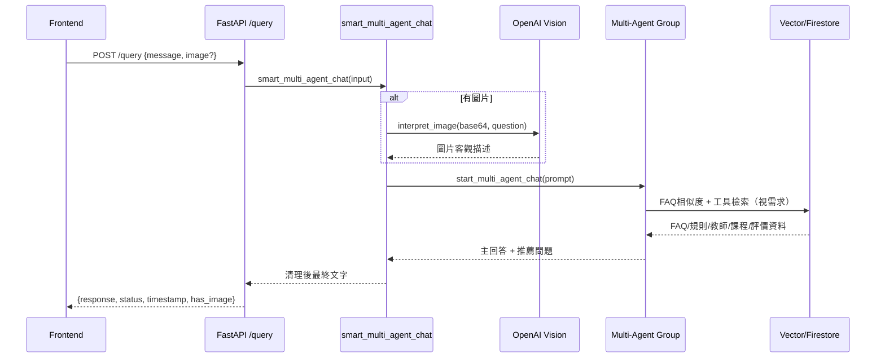

# GradAIde2 AI Agent 對話流程說明

本文件描述目前專案中 AI Agent 對話是如何被接收、判斷、檢索、回答並回傳給前端。

---

## 1) 整體架構（從前端到回覆）

1. 前端送出請求到 `POST /query`。
2. `backend/main.py` 的 `query_model()` 接收資料：
   - 純文字：`message`
   - 圖片對話：`message + image(base64)`
3. 後端呼叫 `smart_multi_agent_chat()`（在 `backend/llm.py`）。
4. 系統依輸入型態走兩條路徑：
   - 文字路徑：直接進入多代理對話
   - 圖片路徑：先用 OpenAI Vision 轉成可理解文字，再進入多代理對話
5. 多代理對話結束後，整理主回答與推薦問題，回傳給前端。

---

## 2) 啟動前置（向量資料庫初始化）

伺服器啟動時（FastAPI lifespan），會做以下流程：

1. 清除舊向量集合：
   - `teachers_vector`
   - `rules_vector`
   - `faq_vector`
2. 呼叫 `init_vectordb()` 重建向量資料。
3. 載入來源：
   - PDF 修課規範（rules）
   - Firestore `Teacher`（teachers）
   - Firestore `InfoHub`（FAQ）
4. 建立檢索工具（目前主要是 `rules`、`teachers`，FAQ採自動相似度檢索）。

> 這代表每次服務重啟，系統會重新整理可檢索知識。

---

## 3) `/query` 請求處理流程

### A. 純文字模式

1. `query_model()` 判斷沒有圖片。
2. 呼叫 `smart_multi_agent_chat(data.message)`。
3. 進入 `start_multi_agent_chat(user_input)` 執行多代理流程。

### B. 圖片模式

1. `query_model()` 判斷有圖片。
2. 呼叫 `smart_multi_agent_chat({"text": message, "image": base64})`。
3. `interpret_image()` 使用 OpenAI Vision 將圖片內容轉成客觀描述。
4. 系統組合成 `combined_prompt`（圖片分析 + 使用者問題）。
5. 將 `combined_prompt` 丟進 `start_multi_agent_chat()`。

---

## 4) 多代理（Multi-Agent）角色分工

在 `start_multi_agent_chat()` 中，主要有以下角色：

1. `User`（UserProxyAgent）
   - 代表使用者發話。
2. `QuestionInspector`
   - 只做「要不要檢索」的快速判斷。
   - 結果通常是：`需要檢索` 或 `不需要檢索`。
3. `RetrieverAgent`
   - 若需要檢索，決定用哪個工具查資料。
   - 可用工具包含：
     - 基本知識：`rules`、`teachers`
     - 課程查詢：`course_search`、`course_name_search`、`teacher_course_search`
     - 評價查詢：`smart_course_review_recommend`、`course_review_search`、`teacher_review_search`
4. `PrimaryAnswerAgent`
   - 產生主要回答（繁體中文、自然語氣）。
   - 會整合：FAQ 相似度結果 + Retriever 查詢結果。
5. `QuestionRecommender`
   - 依主回答內容，補上 3 個延伸推薦問題。

執行順序由 GroupChatManager 固定控制為：

`User → Inspector → Retriever → Primary → Recommender`

---

## 5) FAQ 自動相似度檢索（每次都先做）

在建立代理前，系統會先做 FAQ 相似度檢索：

1. `faq_universal_search(user_input, relevance_threshold=...)`
2. 依門檻過濾結果（目前配置會限制回傳數量）
3. 把可用 FAQ 結果組成 `faq_context`
4. 注入 `PrimaryAnswerAgent` 的 system message

重點：
- 即使 `RetrieverAgent` 判斷「不需要檢索」，FAQ 仍可能已被自動帶入回答。

---

## 6) 回答後處理與回傳格式

對話完成後，系統會：

1. 掃描 `chat_history`，抽出：
   - `PrimaryAnswerAgent` 的內容（主回答）
   - `QuestionRecommender` 的內容（推薦問題）
2. 過濾狀態訊息與模型思考內容：
   - 移除 `<think>...</think>`
   - 移除「檢索完成、推薦完成」等流程字串
3. 做簡轉繁（OpenCC `s2tw`）
4. 組合最終回覆字串
5. 回傳 `/query` JSON：
   - `response`
   - `status`
   - `timestamp`
   - `has_image`

---

## 7) 流程序列圖（簡化）

---

## 8) 設計重點（目前版本）

1. 回答語言以繁體中文為主。
2. FAQ 採「先檢索再回答」策略，提高常見問題命中率。
3. 透過固定代理順序，降低流程混亂。
4. 將「主回答」與「推薦問題」分離，提升可讀性。
5. 圖片與文字共用同一個多代理核心流程，維持一致體驗。

---

## 9) 你可以怎麼擴充

1. 在 `QuestionInspector` 增加更多意圖類型（例如行政流程、活動資訊）。
2. 在 `RetrieverAgent` 增加工具路由規則（例如多工具串接）。
3. 在 `PrimaryAnswerAgent` 增加引用來源格式（提升可追溯性）。
4. 將推薦問題改為可前端結構化顯示（JSON 欄位）。
5. 加入對話記憶（依使用者帳號維持短期上下文）。

---

若你要，我可以再幫你做一版「給簡報用」的流程圖版（更短、更視覺化）。
